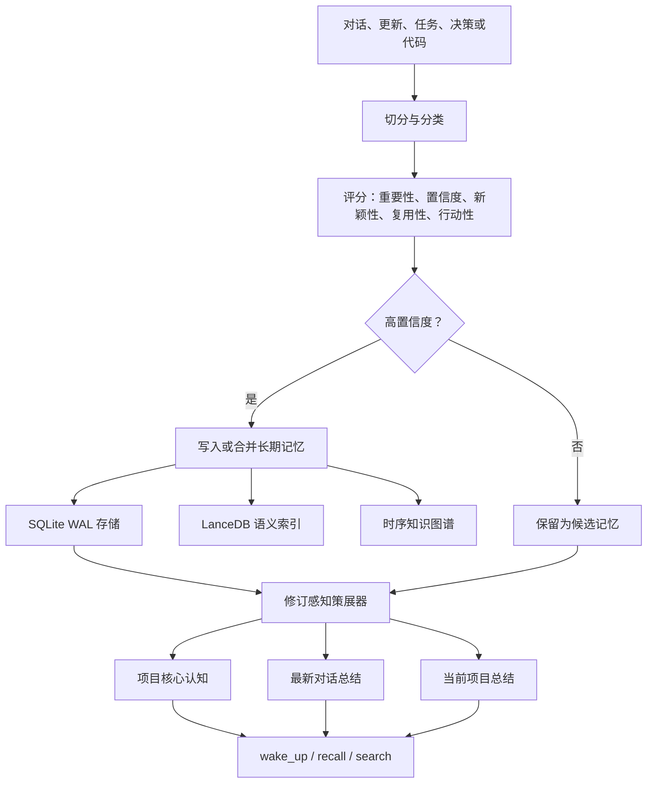

# Cognilattice / Memery

**面向 AI Agent 的本地优先、持续策展型记忆网络。**

[English README](README.md)

## 项目简介

Cognilattice 是一个本地优先的 MCP 记忆服务器，用来把对话、项目更新、决策、任务、代码结构、专业画像和长期上下文整理成可持续使用的 AI 记忆层。它不是简单保存聊天记录，而是把重要信息筛选、评分、归类、汇总并固定在可唤醒的上下文顶层，使 AI Agent 在新会话中不必从零开始理解项目。

一句话描述：

```text
本地优先的 AI Agent MCP 记忆网络，支持策展摘要、认知画像、图谱上下文与压力测试检索。
```

## 核心认知

Cognilattice 的核心思想是：长期记忆不应该只是 transcript archive，而应该是一个会自我整理的认知网格。

每个上下文会固定维护三类受保护的顶层记忆：

1. `project_core`：项目目标、原则、架构、长期约束和核心思想。
2. `latest_conversation_summary`：最近一次对话或更新的可替换摘要。
3. `project_summary`：当前已完成内容、未完成事项、约束和关键决策。

这些记忆会被固定、原地更新、优先返回，并受到压缩和清理流程保护。

## 能记住什么

Cognilattice 不局限于软件项目。上下文类型包括：

- `software`：架构、接口、Bug、部署、实现进度。
- `research`：研究问题、假设、方法、证据、实验和下一步。
- `business`：目标、客户、策略、规则、风险和执行状态。
- `learning`：学习目标、知识框架、已掌握内容和剩余任务。
- `general`：任何需要长期连续性的事项。
- `auto`：根据内容自动推断合适类型。

普通记忆可以被归类为目标、原则、偏好、事实、事件、计划、决策、架构、API 契约、Bug、任务快照等类型。

## 工作机制



写入评分公式：

```text
score = importance * 0.30
      + confidence * 0.20
      + novelty * 0.15
      + reusability * 0.20
      + actionability * 0.15
```

高分记忆会自动进入长期记忆；不确定内容会进入候选队列，等待审阅，而不是直接变成“事实”。

## 人格到职业的认知画像

系统支持在写入前为上下文绑定 memory profile。画像由两部分组成：

- `personality`：决定注意力、执行压力和记忆偏好。
- `profession`：决定专业对象、方法、评价标准、案例记忆和错误记忆。

内置画像包括 `generalist_v1`、`software_engineer_v1`、`research_scientist_v1` 和 `clinical_reasoner_v1`。当前设置流程还提供 36 个人格预设和 216 个职业预设，组合后生成运行时记忆脚手架。

画像感知写入会保存 `base_score`、`store_score`、`memory_layer`、`trait_features`、`profession_features` 和 `score_reason`，使之后的策展过程能够解释为什么某条记忆被保留。记忆会被路由到 `semantic`、`episodic`、`procedural` 或 `error` 层。

可以直接用预设 id 创建自定义画像：

```json
{
  "tool": "create_memory_profile",
  "arguments": {
    "profile_id": "rigorous_stats_v1",
    "personality_id": "rigorous_validator_v1",
    "profession_id": "statistician_v1",
    "overrides": {
      "calibration": {
        "store_threshold": 0.82
      }
    }
  }
}
```

`calibration` 是数值评分配置，不是行为准则散文。常用键包括 `trait_weight`、`profession_weight`、`learning_weight`、`risk_penalty_weight`、`store_threshold` 和 `retrieve_threshold`。如果 JSON 解析失败，错误会指出具体字段，例如 `Invalid JSON in field 'calibration': ...`。

预设列表工具默认使用紧凑分页输出。用 `list_profession_presets(id="statistician_v1")` 获取单条预设，用 `offset` 和 `limit` 翻页，用 `fields` 过滤字段，只有确实需要完整 prompt scaffold 时才传 `compact=false`。

## 存储与检索

- SQLite WAL 保存项目、记忆、候选、任务、决策、边和时序三元组。
- 每个工作线程使用独立 SQLite 连接，支持并发读取和受控写入竞争。
- LanceDB 保存本地语义向量。
- 默认使用字符 n-gram TF-IDF，做到无 API key 的本地嵌入。
- 向量搜索先按项目过滤，避免跨项目污染。
- Graphify 和 NetworkX 可用于代码结构图谱。
- MemPalace 可作为空间记忆和时序知识图谱的可选集成。

Graphify 和 MemPalace 是可选依赖。即使不安装它们，核心 MCP 服务、SQLite 存储、LanceDB 检索、上下文总结、任务记录、决策记录和确定性 hall 路由仍然可用。

## 安装

推荐 Python 3.10 或更新版本。

```bash
python -m venv .venv
```

Windows PowerShell：

```powershell
.\.venv\Scripts\Activate.ps1
```

Linux/macOS：

```bash
source .venv/bin/activate
```

安装：

```bash
python -m pip install --upgrade pip
pip install -e .
```

开发安装：

```bash
pip install -e ".[dev]"
```

可选集成：

```bash
pip install -e ".[graph]"
pip install -e ".[palace]"
pip install -e ".[all]"
```

检查安装：

```bash
memery doctor
```

配置默认人格/职业画像：

```bash
memery configure
```

无人值守配置：

```bash
memery configure --profile software_engineer_v1 --yes
```

## MCP 客户端配置

```json
{
  "mcpServers": {
    "memery": {
      "command": "/absolute/path/to/python",
      "args": ["-m", "memory_server"]
    }
  }
}
```

也可以在安装后使用 `memery` 作为 MCP stdio server。面向人类的健康检查请使用 `memery doctor`。

同一台机器一次只能运行一个 Memery/Cognilattice MCP 服务。服务启动时会默认在 `~/.memery/cache/memery-service.lock` 获取 OS 级独占锁；如果已有实例在运行，第二个实例会直接退出并给出明确错误。只有在隔离测试场景下才建议用 `MEMERY_SERVICE_LOCK_PATH` 覆盖锁路径。

## 基础使用

创建上下文：

```json
{
  "tool": "create_context",
  "arguments": {
    "name": "edge-memory-research",
    "description": "Investigate durable memory on resource-constrained devices.",
    "context_type": "research"
  }
}
```

绑定画像：

```json
{
  "tool": "set_project_profile",
  "arguments": {
    "project_name": "edge-memory-research",
    "profile_id": "research_scientist_v1"
  }
}
```

写入更新：

```json
{
  "tool": "ingest_update",
  "arguments": {
    "context_name": "edge-memory-research",
    "update_text": "We completed the SQLite concurrency layer. Next, benchmark vector retrieval on ARM devices.",
    "source_type": "research-note"
  }
}
```

新会话唤醒：

```json
{
  "tool": "wake_up",
  "arguments": {
    "project_name": "edge-memory-research"
  }
}
```

任务召回：

```json
{
  "tool": "recall_for_task",
  "arguments": {
    "project_name": "edge-memory-research",
    "task": "continue the ARM vector retrieval benchmark",
    "limit": 10
  }
}
```

批量写入：

```json
{
  "tool": "write_memories_batch",
  "arguments": {
    "project_name": "edge-memory-research",
    "memories": "[{\"memory_type\":\"fact\",\"title\":\"Device\",\"content\":\"The target device has 8 GB RAM.\"}]"
  }
}
```

## 主要 MCP 工具

| 领域 | 工具 |
|---|---|
| 上下文 | `create_context`, `create_project`, `wake_up`, `get_top_level_memory`, `get_context_bundle` |
| 画像 | `get_setup_status`, `configure_memory_defaults`, `list_memory_profiles`, `list_personality_presets`, `list_profession_presets`, `get_memory_profile`, `create_memory_profile`, `delete_memory_profile`, `set_project_profile`, `record_memory_feedback`, `list_memory_feedback` |
| 写入 | `ingest_update`, `ingest_conversation`, `extract_memory_candidates`, `review_memory_candidate` |
| 记忆 | `write_memory`, `write_memories_batch`, `search_memory`, `recall_for_task`, `list_memories` |
| 策展 | `refresh_project_summary`, `update_latest_conversation_summary`, `compact_project_memory`, `prune_low_value_memories` |
| 进度 | `record_task_snapshot`, `record_decision`, `list_task_snapshots`, `list_decisions` |
| 代码图谱 | `analyze_project_code`, `get_graph_neighbors`, `query_graph_path`, `get_graph_stats` |
| 知识图谱 | `add_knowledge_triple`, `query_entity`, `query_entity_timeline`, `invalidate_triple` |

## 性能设计

- 线程本地 SQLite 连接避免跨线程连接错误。
- 启用 WAL、`synchronous=NORMAL`、内存临时存储、32 MiB page cache 和 mmap。
- 项目、状态、类型、分数和更新时间都有组合索引。
- 批量写入最多可在一个事务中写入 5,000 条记忆。
- 摘要来源限制在 120 条高价值或近期记忆。
- 项目修订计数器让未变化摘要刷新变成常量时间缓存命中。
- 顶层上下文有内存缓存，冷读只需一次索引查询。
- 固定摘要不进入向量库，因为会被直接返回。
- LanceDB 操作由可重入锁保护，语义搜索使用项目级原生预过滤。

SQLite 仍然是单写者数据库。高比例并发写入会带来尾延迟尖峰，因此持续导入应优先使用批量写入。

## 压力测试

以下结果来自 2026 年 6 月在 Windows + Python 3.10 上的本地测试。它们是实现基准，不是通用硬件承诺。

运行参数：

```powershell
python benchmarks\benchmark_stress.py `
  --memories 30000 `
  --batch-size 1000 `
  --operations 30000 `
  --workers 128 `
  --write-percent 1 `
  --summary-iterations 1000 `
  --hot-reads 100000 `
  --real-vector-items 10000 `
  --vector-searches 500
```

`--write-percent 1` 表示每十个混合操作中有一个写操作，也就是 10% 写入负载。

| 负载 | 吞吐 | P50 | P95 | P99 | 错误 |
|---|---:|---:|---:|---:|---:|
| 批量 SQLite 插入，30,000 条记忆 | 16,792.6 ops/s | 54.35 ms/batch | 79.80 ms/batch | 86.47 ms/batch | 0 |
| 未变化摘要刷新，1,000 次 | 46,989.2 ops/s | 0.018 ms | 0.029 ms | 0.041 ms | 0 |
| 缓存顶层读取，100,000 次 | 79,402.0 ops/s | 0.010 ms | 0.017 ms | 0.027 ms | 0 |
| 混合 SQLite 负载，128 workers，10% 写入 | 511.0 ops/s | 259.82 ms | 382.01 ms | 1,246.79 ms | 0 |
| 真实向量批量插入，10,000 条 | 13,318.9 ops/s | - | - | - | 0 |
| 10,000 向量上的真实搜索 | 48.2 searches/s | 20.52 ms | 23.96 ms | 26.38 ms | 0 |

优化前，初始实现使用共享 SQLite 连接，在 16 线程混合测试中 1,000 次操作全部失败。引入线程本地连接、WAL 调优、有界摘要、修订感知缓存和查询重构后，压力测试达到零错误。

同一 20,000 条记忆负载下的改进：

- 顶层读取：约 `126` 提升到 `68,911+ ops/s`。
- 摘要刷新：未变化时约 `36.8` 提升到 `48,000+ ops/s`。
- 32 线程混合吞吐：约 `553` 提升到 `684-699 ops/s`。
- 向量搜索 P95：使用原生项目预过滤后约从 `39 ms` 降到 `21.8-24 ms`。

已测试 LanceDB IVF-PQ 索引构建，但本地 10,000 向量语料触发 Rust KMeans panic，因此当前默认不自动启用该不稳定索引。默认使用项目预过滤的 flat vector search。

## 测试

```powershell
$env:PYTEST_DISABLE_PLUGIN_AUTOLOAD = "1"
python -m pytest -q
Remove-Item Env:PYTEST_DISABLE_PLUGIN_AUTOLOAD
```

当前结果：

```text
10 passed
```

小规模基准：

```powershell
python benchmarks\benchmark_stress.py `
  --memories 20000 `
  --operations 20000 `
  --workers 32
```

## 配置

配置加载顺序：

1. 环境变量。
2. `~/.memery/config.json`。
3. 内置默认值。

| 变量 | 用途 |
|---|---|
| `MEMERY_DATA_DIR` | 数据目录 |
| `MEMERY_DB_PATH` | SQLite 数据库路径 |
| `MEMERY_VECTOR_BACKEND` | 向量后端，目前为 `lancedb` |
| `MEMERY_EMBEDDING_DIM` | 嵌入维度 |
| `MEMERY_PALACE_VECTOR_ENABLED` | 启用可选 MemPalace/Chroma 二级向量写入路径 |

默认本地路径：

```text
~/.memery/memory.db
~/.memery/data/lancedb_data/
~/.memery/data/palace/
~/.memery/cache/
~/.memery/config.json
```

备份时请备份完整的 `~/.memery` 目录。

## 仓库结构

```text
backends/                  向量后端实现
benchmarks/                本地压力测试脚本
palace/                    MemPalace 路由与时序图谱适配
pipeline/                  Graphify 代码分析管线
tests/                     回归测试与冒烟测试
config.py                  配置与运行时路径
curator.py                 写入、评分、摘要、压缩与清理
db.py                      SQLite schema 与持久化层
server.py                  MCP 工具与服务器入口
pyproject.toml             打包、依赖与命令行入口
```

## 设计原则

1. 本地优先：有用记忆不应依赖托管 API。
2. 连续性优先于原始记录：保存当前意义，而不只是保存时间线。
3. 显式不确定性：推断和模糊内容不能伪装成事实。
4. 稳定身份：摘要原地更新，不无限追加。
5. 有界召回：最重要上下文固定在顶层，深层历史可搜索。
6. 性能就是正确性：不能承受持续使用的记忆系统最终会被绕开。
7. 不制造虚假速度：分别报告 SQLite 和向量检索，公开尾延迟和错误数。

## 当前限制

- SQLite 单写者模型决定了高写入比例下会有尾延迟。
- 默认 TF-IDF 向量轻量且本地，但不能替代所有领域里的强多语嵌入模型。
- 摘要抽取是确定性启发式，最佳效果需要明确任务快照或决策记录配合。
- Graphify 和 MemPalace 是外部依赖，行为可能随版本变化。
- ANN 自动索引在 LanceDB 压力测试稳定前保持关闭。

## 许可证与免责声明

Cognilattice / Memery 使用 [Apache License 2.0](LICENSE)。软件按 **"AS IS"** 提供，不附带任何形式的担保。请查看 [DISCLAIMER.md](DISCLAIMER.md)、[SECURITY.md](SECURITY.md) 和 [CONTRIBUTING.md](CONTRIBUTING.md)。
